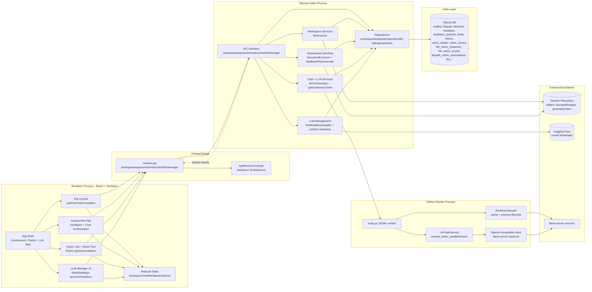

# EssayLens Architecture

```mermaid
flowchart LR
  subgraph UI[Renderer Process - React + TanStack]
    APP[App Shell\nAssessment / Rubric / LLM Tabs]
    FC[File Control\nuseFileControl mutation]
    ASSESS[Assessment Tab\nFeedback + Chat orchestration]
    RUBRIC[Rubric Tab + Score Tool\nRubric queries/mutations]
    LLMUI[LLM Manager UI\nModel/settings queries/mutations]
    STATE[Reducer State\nworkspace/chat/feedback/rubric/ui]
  end

  subgraph PRELOAD[Preload Bridge]
    API[window.api\nworkspace/assessment/rubric/chat/llmManager]
    RESULT[AppResult Envelope\nok/data or ok:false/error]
  end

  subgraph MAIN[Electron Main Process]
    IPC[IPC Handlers\nworkspace/assessment/rubric/chat/llmManager]
    WSVC[Workspace Services\nfileScanner]
    ASVC[Assessment Services\ndocumentExtractor + feedbackFileGenerator]
    CSVC[Chat + LLM Services\nllmOrchestrator + pythonWorkerClient]
    LMSVC[LLM Management\nllmModelDownloader + runtime readiness]
    REPO[Repositories\nworkspace/feedback/chat/rubric/llm settings/selection]
  end

  subgraph PY[Python Worker Process]
    ENTRY[main.py JSONL worker]
    TASK[LlmTaskService\nprompt_tester_parallel/stream]
    CLIENT[OpenAI-compatible client\nllama-server backend]
    LIFE[RuntimeLifecycle\ncache + process lifecycle]
  end

  subgraph DATA[Data Layer]
    SQLITE[(SQLite DB\nentities, filepath, filename, feedback,\nfeedback_anchors, chats, rubrics,\nrubric_details, rubric_scores,\nfile_rubric_instances, file_rubric_scores,\nfilepath_rubric_associations, llm_*)]
  end

  subgraph EXT[External Boundaries]
    FS[(Teacher Filesystem\nfolders, docx/pdf/images, generated docx)]
    HF[(Hugging Face\nmodel downloads)]
    LLAMA[llama-server process]
  end

  APP --> FC
  APP --> ASSESS
  APP --> RUBRIC
  APP --> LLMUI
  FC --> STATE
  ASSESS --> STATE
  RUBRIC --> STATE
  LLMUI --> STATE

  FC --> API
  ASSESS --> API
  RUBRIC --> API
  LLMUI --> API

  API --> RESULT
  API --> IPC

  IPC --> WSVC
  IPC --> ASVC
  IPC --> CSVC
  IPC --> LMSVC
  IPC --> REPO

  WSVC --> REPO
  ASVC --> REPO
  CSVC --> REPO
  LMSVC --> REPO
  REPO --> SQLITE

  WSVC --> FS
  ASVC --> FS
  LMSVC --> HF

  CSVC --> ENTRY
  ENTRY --> TASK
  TASK --> CLIENT
  ENTRY --> LIFE
  LIFE --> LLAMA
  CLIENT --> LLAMA

  IPC -.stream events.-> API
```
