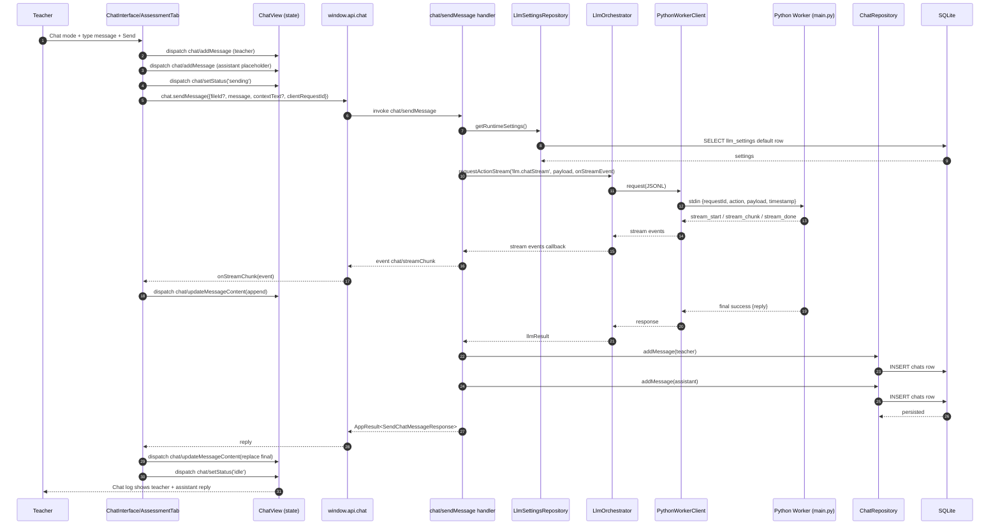

# Vertical Slice: Chat With LLM

This slice covers teacher chat in `Chat` mode from `ChatInterface`, including streaming events, final reply handling, and message persistence.

## 1) User input/action

- Teacher switches `ChatToggle` to `Chat` mode.
- Teacher enters a message in `ChatInput` and presses send.
- Expected outcome:
  - Teacher message appears in chat log immediately.
  - Assistant placeholder appears, then receives streamed chunks (if enabled).
  - Final assistant reply is persisted and shown in `ChatView`.

## 2) React components where actions/inputs occur and related functions/types

- `renderer/src/features/layout/components/ChatInterface/ChatToggle.tsx`
  - Mode switch between `comment` and `chat`.

- `renderer/src/features/layout/components/ChatInterface/ChatInterface.tsx`
  - Send button triggers `onSubmit` from AssessmentTab bindings.

- `renderer/src/features/assessment-tab/components/AssessmentTab.tsx`
  - `handleSubmit()` chat branch:
    - creates `clientRequestId`
    - dispatches local teacher + assistant messages
    - calls `chatApi.sendMessage(...)`
  - Registers streaming listener:
    - `chatApi.onStreamChunk(...)`

- `renderer/src/features/layout/components/ChatView.tsx`
  - Renders `state.chat.messages`.

- Related shared types:
  - `SendChatMessageRequest`, `SendChatMessageResponse`, `ChatStreamChunkEvent`
  - File: `electron/shared/chatContracts.ts`

## 3) Related hooks, reducers and services (include filenames)

- Assessment orchestration:
  - `renderer/src/features/assessment-tab/components/AssessmentTab.tsx`
  - Local refs maintain streaming correlation:
    - `streamMessageByClientRequestId`
    - `streamSeqByClientRequestId`

- Reducer actions in this flow:
  - `chat/addMessage`
  - `chat/updateMessageContent` (`append` for chunk, `replace` for final reply)
  - `chat/setStatus`
  - `chat/setError`

- Renderer bridge usage:
  - Direct preload API access via `window.api.chat` in `AssessmentTab.tsx`

- Main services/repositories:
  - Handler: `electron/main/ipc/chatHandlers.ts`
  - Orchestrator: `electron/main/services/llmOrchestrator.ts`
  - Python bridge: `electron/main/services/pythonWorkerClient.ts`
  - Chat persistence: `electron/main/db/repositories/chatRepository.ts`
  - LLM readiness/settings: `llmSettingsRepository.ts`, `llmSelectionRepository.ts`, `llmRuntimeReadiness.ts`

## 4) TanStack queries and mutations called (include filenames)

- None for this chat path.
- Chat send and stream handling are currently component-driven async calls in `AssessmentTab.tsx`, not TanStack query/mutation hooks.

## 5) IPC handlers called and related types

- `chat/sendMessage`
  - Handler: `electron/main/ipc/chatHandlers.ts`
  - Request: `SendChatMessageRequest`
  - Response: `SendChatMessageResponse`

- Streaming event channel:
  - Event: `chat/streamChunk`
  - Payload: `ChatStreamChunkEvent`

- Optional list channel exists but not core to submit path:
  - `chat/listMessages`

- Envelope:
  - `AppResult<T>` from `electron/shared/appResult.ts`

## 6) Electron services called and related types

Inside `chat/sendMessage` handler:

- Load runtime settings:
  - `LlmSettingsRepository.getRuntimeSettings()`

- Validate runtime readiness:
  - `getLlmNotReadyDetails(settings, ...)`
  - Optional recovery path uses `LlmSelectionRepository.resetSettingsToDefaults(...)`

- Call orchestrator:
  - Prefer stream path when available:
    - `LlmOrchestrator.requestActionStream('llm.chatStream', llmPayload, onStreamEvent)`
  - Fallback non-stream:
    - `LlmOrchestrator.requestAction('llm.chat', llmPayload)`

- Persist messages:
  - `ChatRepository.addMessage(...)` for teacher
  - `ChatRepository.addMessage(...)` for assistant

- Related types:
  - `LlmRuntimeSettings` (`llmManagerContracts.ts`)
  - Python envelopes/actions (`electron/shared/llmContracts.ts`)

## 7) Python functions called

Worker entry and action routing (`electron-llm/main.py`):

- `llm.chat` -> `_run_chat(payload, lifecycle)`
- `llm.chatStream` -> `_run_chat_stream(payload, request_id, lifecycle)`

Service/task calls from worker:

- Runtime/container setup:
  - `_build_runtime(...)` -> `build_settings_from_payload(...)` + `RuntimeLifecycle.get_or_create_llm_runtime(...)`

- Chat execution:
  - Non-stream path:
    - `LlmTaskService.prompt_tester_parallel(app_cfg, text_tasks=[message], max_concurrency=1)`
  - Stream path:
    - `LlmTaskService.prompt_tester_stream(app_cfg, text=message)`

Files:
- `electron-llm/main.py`
- `electron-llm/services/llm_task_service.py`
- `electron-llm/app/container.py`
- `electron-llm/app/runtime_lifecycle.py`

## 8) Any database queries made

### Settings/readiness phase

From `LlmSettingsRepository.getRuntimeSettings()`:
- `SELECT ... FROM llm_settings WHERE id = 'default' LIMIT 1;`

Potential recovery path (`resetSettingsToDefaults`):
- Reads active model from `llm_selection`
- Upserts/updates default row in `llm_settings`

### Chat persistence phase

From `ChatRepository.addMessage(...)`:

- Ensure entity exists:
  - `INSERT INTO entities (uuid, type, created_at) ... ON CONFLICT(uuid) DO NOTHING;`
  - (or global chat entity via `ensureGlobalChatEntity`)

- Insert chat row (twice: teacher + assistant):
  - `INSERT INTO chats (uuid, entity_uuid, chat_role, chat_header, chat_content, created_at)
     VALUES (?, ?, ?, NULL, ?, ?);`

### Optional list/read phase

From `ChatRepository.listMessages(fileId?)`:
- `SELECT uuid, entity_uuid, chat_role, chat_content, created_at FROM chats ... ORDER BY ...;`

## Mermaid Workflow Diagram

