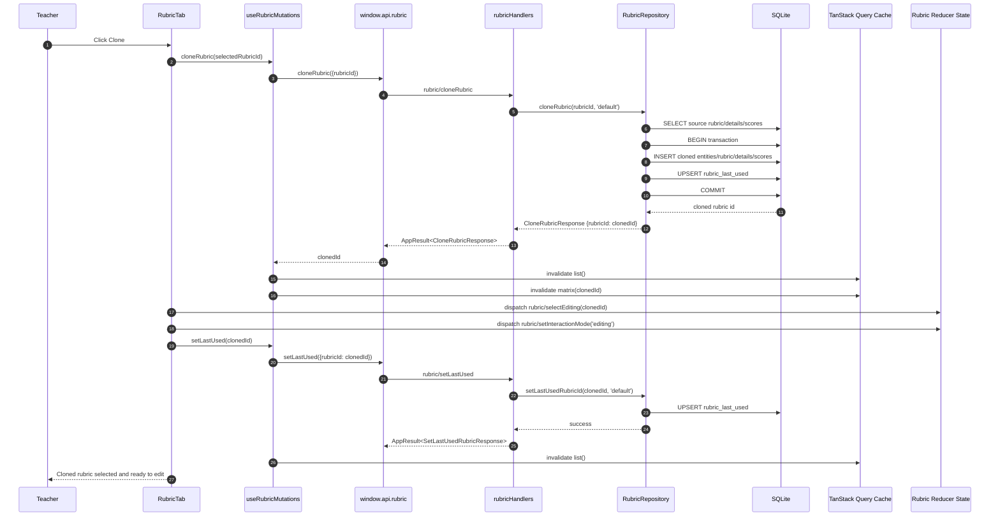

# Vertical Slice: Clone Rubric

This slice covers cloning an existing rubric from the Rubric tab.

## 1) User input/action

- Teacher opens the Rubric tab and clicks `Clone` for the selected rubric.
- Expected outcome:
  - A new rubric is created as a clone of the source rubric.
  - New rubric becomes selected for editing.
  - Last-used rubric is updated to the cloned rubric.

## 2) React components where actions/inputs occur and related functions/types

- `renderer/src/features/rubric-tab/components/RubricTab.tsx`
  - Clone button click handler:
    - `const clonedRubricId = await cloneRubric(selectedRubricId)`
    - `dispatch({ type: 'rubric/selectEditing', payload: clonedRubricId })`
    - `dispatch({ type: 'rubric/setInteractionMode', payload: 'editing' })`
    - `await setLastUsed(clonedRubricId)`

- Related types:
  - `CloneRubricRequest`, `CloneRubricResponse`
  - `SetLastUsedRubricRequest`, `SetLastUsedRubricResponse`
  - File: `electron/shared/rubricContracts.ts`

## 3) Related hooks, reducers and services (include filenames)

- Hook:
  - `renderer/src/features/rubric-tab/hooks/useRubricMutations.ts`
  - `cloneRubricMutation` calls `cloneRubricRequest(sourceRubricId)`
  - `setLastUsedMutation` calls `setLastUsedRubric(nextRubricId)`

- Reducers/actions:
  - `rubricReducer` in `renderer/src/state/reducers.ts`
  - Actions used in this flow:
    - `rubric/selectEditing`
    - `rubric/setInteractionMode`

- Renderer API services:
  - `renderer/src/features/rubric-tab/services/rubricApi.ts`
    - `cloneRubric(rubricId)`
    - `setLastUsedRubric(rubricId)`

- Main service/repository:
  - `electron/main/ipc/rubricHandlers.ts`
  - `electron/main/db/repositories/rubricRepository.ts` (`cloneRubric`, `setLastUsedRubricId`)

## 4) TanStack queries and mutations called (include filenames)

- Mutation: clone rubric
  - File: `renderer/src/features/rubric-tab/hooks/useRubricMutations.ts`
  - `cloneRubricMutation`

- Mutation: set last used rubric
  - File: `renderer/src/features/rubric-tab/hooks/useRubricMutations.ts`
  - `setLastUsedMutation`

- Query invalidations from clone mutation success:
  - `rubricQueryKeys.list()`
  - `rubricQueryKeys.matrix(clonedRubricId)`

- Query invalidation from set-last-used success:
  - `rubricQueryKeys.list()`

## 5) IPC handlers called and related types

- Clone request:
  - Channel: `rubric/cloneRubric`
  - Handler: `electron/main/ipc/rubricHandlers.ts`
  - Types: `CloneRubricRequest`, `CloneRubricResponse`

- Set last-used request:
  - Channel: `rubric/setLastUsed`
  - Handler: `electron/main/ipc/rubricHandlers.ts`
  - Types: `SetLastUsedRubricRequest`, `SetLastUsedRubricResponse`

- Response envelope:
  - `AppResult<T>` from `electron/shared/appResult.ts`

## 6) Electron services called and related types

- `RubricRepository.cloneRubric(rubricId, profileKey)`
  - Reads source rubric/details/scores.
  - Creates new rubric entity UUID.
  - Inserts cloned rubric, details, and scores.
  - Updates `rubric_last_used` to cloned rubric.

- `RubricRepository.setLastUsedRubricId(rubricId, profileKey)`
  - Confirms rubric exists and is not archived.
  - Upserts `rubric_last_used`.

- Key DTO/type boundary:
  - `RubricDto`, `RubricDetailDto`, `RubricScoreDto` (shared contracts)

## 7) Python functions called

- None.
- Rubric cloning is renderer + Electron + SQLite only.

## 8) Any database queries made

From `RubricRepository.cloneRubric(...)`:

- Load source rubric:
  - `SELECT entity_uuid, name, type, is_active, is_archived
     FROM rubrics
     WHERE entity_uuid = ?
     LIMIT 1;`

- Load source details:
  - `SELECT uuid, entity_uuid, category, description
     FROM rubric_details
     WHERE entity_uuid = ?
     ORDER BY uuid ASC;`

- Load source scores:
  - `SELECT uuid, details_uuid, score_values
     FROM rubric_scores
     WHERE details_uuid IN (...)
     ORDER BY uuid ASC;`

- Transactional inserts/updates:
  - `INSERT INTO entities (uuid, type, created_at) ...`
  - `INSERT INTO rubrics (entity_uuid, name, type, is_active, is_archived) VALUES (...);`
  - `INSERT INTO rubric_details (uuid, entity_uuid, category, description) VALUES (...);`
  - `INSERT INTO rubric_scores (uuid, details_uuid, score_values) VALUES (...);`
  - `INSERT INTO rubric_last_used (profile_key, rubric_entity_uuid, updated_at)
     VALUES (?, ?, ?)
     ON CONFLICT(profile_key)
     DO UPDATE SET rubric_entity_uuid = excluded.rubric_entity_uuid, updated_at = excluded.updated_at;`

From `RubricRepository.setLastUsedRubricId(...)`:

- Validate rubric:
  - `SELECT entity_uuid FROM rubrics WHERE entity_uuid = ? AND is_archived = 0 LIMIT 1;`

- Upsert last-used pointer:
  - `INSERT INTO rubric_last_used (...) VALUES (...) ON CONFLICT(profile_key) DO UPDATE ...;`

## Mermaid Workflow Diagram

