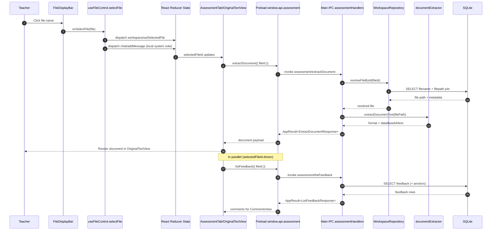

# Vertical Slice: File Selection (End to End)

This slice covers the flow when a teacher clicks a file in the file list and the app loads it for assessment.

## 1) User input/action

- User clicks a filename in the file list (FileDisplayBar).
- Expected outcome:
  - Selected file becomes active in app state.
  - System message is added to local chat state.
  - Assessment view requests document extraction and renders the selected document.
  - Feedback list query for that file is triggered.

## 2) React components where actions/inputs occur + related functions/types

- `renderer/src/features/layout/components/FileDisplayBar.tsx`
  - Renders available files and emits file-click action.

- `renderer/src/features/file-control/components/FileControl.tsx`
  - Receives `onSelectFile` from container and routes file click.

- `renderer/src/features/file-control/FileControlContainer.tsx`
  - Wires `selectFile` from `useFileControl()` into `FileControl`.

- `renderer/src/features/assessment-tab/components/AssessmentTab.tsx`
  - Reads selected file from workspace state and passes `selectedFileId` into `OriginalTextView`.

- `renderer/src/features/assessment-tab/components/OriginalTextView/OriginalTextView.tsx`
  - Hosts document view and selection interactions.

- `renderer/src/features/assessment-tab/components/OriginalTextView/hooks/useTextViewDocument.ts`
  - Performs document load via API and renders DOCX.

- Related types:
  - `WorkspaceFile`, `SelectedFileState`, `ChatMessage`: `renderer/src/types/models.ts` / `renderer/src/state/types.ts`
  - `ExtractDocumentRequest`, `ExtractDocumentResponse`: `electron/shared/assessmentContracts.ts`
  - `AppResult`: `electron/shared/appResult.ts`

## 3) Related hooks, reducers, and services (with filenames)

- Hook handling file click:
  - `renderer/src/features/file-control/hooks/useFileControl.ts`
  - `selectFile(file)` dispatches:
    - `workspace/setSelectedFile`
    - `chat/addMessage` (local system message: `Selected file: ...`)

- Hook loading selected file document:
  - `renderer/src/features/assessment-tab/components/OriginalTextView/hooks/useTextViewDocument.ts`
  - Calls `extractDocument(selectedFileId)` from `renderer/src/features/assessment-tab/hooks/feedbackApi.ts`
  - For DOCX, decodes base64, builds map via `docxTextMap.ts`, renders via `docx-preview`, bridges via `renderBridge.ts`

- Reducers involved:
  - `workspaceReducer` in `renderer/src/state/reducers.ts` (`workspace/setSelectedFile`)
  - `chatReducer` in `renderer/src/state/reducers.ts` (`chat/addMessage`)
  - `feedbackReducer` (indirectly, through feedback query tied to selected file)

- Electron main services used in extraction path:
  - `electron/main/services/documentExtractor.ts`
  - `electron/main/db/repositories/workspaceRepository.ts` (`resolveFileById`)

## 4) TanStack queries and mutations called (with filenames)

- Direct file-click action:
  - No TanStack mutation/query; handled by local dispatch in `useFileControl.ts`.

- Queries triggered by selected file state:
  - `useFeedbackListQuery(selectedFileId)` in `renderer/src/features/assessment-tab/hooks/useFeedbackListQuery.ts`
    - Query key: `assessmentQueryKeys.feedbackList(fileId)`
    - Calls `assessment/listFeedback` via `feedbackApi.listFeedback`.

- Document extraction:
  - Not a TanStack query in current code; `useEffect`-driven async call in `useTextViewDocument.ts`.

## 5) IPC handlers called + related types

- `assessment/extractDocument`
  - Handler: `electron/main/ipc/assessmentHandlers.ts`
  - Request type: `ExtractDocumentRequest`
  - Response type: `ExtractDocumentResponse`

- `assessment/listFeedback` (triggered for selected file comments pane)
  - Handler: `electron/main/ipc/assessmentHandlers.ts`
  - Request type: `ListFeedbackRequest`
  - Response type: `ListFeedbackResponse`

- Contract files:
  - `electron/shared/assessmentContracts.ts`
  - `electron/shared/appResult.ts`

## 6) Electron services called + related types

- On `assessment/extractDocument`:
  - `WorkspaceRepository.resolveFileById(fileId)` to map entity ID -> absolute path
  - `extractDocumentText(filePath)` in `electron/main/services/documentExtractor.ts`
    - Returns `ExtractedDocument { text, extractedAt, format, dataBase64? }`

- Current extractor behavior:
  - `.docx` and `.pdf`: reads bytes and returns base64 payload (`dataBase64`), `text` currently empty.
  - other formats: returns `format: 'other'` with empty text.

## 7) Python functions called

- None in this slice.
- File selection and extraction do not call chat/LLM orchestration or Python worker.

## 8) Database queries made

From `WorkspaceRepository.resolveFileById(...)` in `electron/main/db/repositories/workspaceRepository.ts`:

- `SELECT f.entity_uuid, f.filepath_uuid, f.append_path, f.file_name, p.path AS folder_path
   FROM filename AS f
   INNER JOIN filepath AS p ON p.uuid = f.filepath_uuid
   WHERE f.entity_uuid = ?
   LIMIT 1;`

From `FeedbackRepository.listByFileId(...)` in `electron/main/db/repositories/feedbackRepository.ts` (comments pane query):

- `SELECT uuid, entity_uuid, kind, source, comment_text, exact_quote, prefix_text, suffix_text, applied, created_at, updated_at
   FROM feedback
   WHERE entity_uuid = ?
   ORDER BY created_at ASC, uuid ASC;`

- If feedback rows exist, anchors are loaded with dynamic `IN (...)` placeholders:
  - `SELECT feedback_uuid, anchor_kind, part, paragraph_index, run_index, text_node_index, char_offset
     FROM feedback_anchors
     WHERE feedback_uuid IN (...)
     ORDER BY feedback_uuid ASC, anchor_kind ASC;`

Notes:
- Clicking a file does not itself write to DB in current code.
- The local system chat message on file selection is reducer-only and is not persisted to `chats` table unless `chat/sendMessage` is used.

## Mermaid Workflow Diagram

