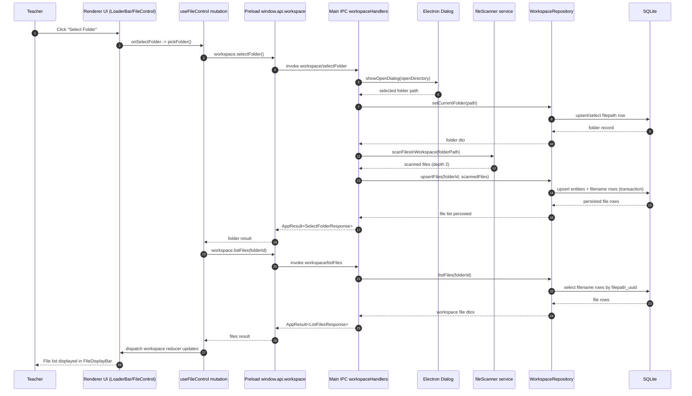

# Vertical Slice: Folder Selection (End to End)

This slice covers the flow when a teacher selects a workspace folder and the app indexes files for display.

## 1) User input/action

- User clicks the folder-select control in the File Control area.
- UI entry point: `LoaderBar` select-folder action wired through `FileControl`.

## 2) React components where actions/inputs occur + related functions/types

- `renderer/src/features/file-control/FileControlContainer.tsx`
  - Uses `useFileControl()` and passes `onSelectFolder={() => void pickFolder()}`.

- `renderer/src/features/file-control/components/FileControl.tsx`
  - Receives `onSelectFolder` prop and passes it to UI controls.

- `renderer/src/features/layout/components/LoaderBar.tsx`
  - User clicks the folder button that triggers `onSelectFolder`.

- Related renderer/shared types:
  - `WorkspaceFolder`, `WorkspaceFile`: `renderer/src/types/models.ts`
  - `SelectFolderResponse`, `ListFilesResponse`, `WorkspaceFileDto`: `electron/shared/workspaceContracts.ts`
  - `AppResult`: `electron/shared/appResult.ts`

## 3) Related hooks, reducers, and services (with filenames)

- Hook:
  - `renderer/src/features/file-control/hooks/useFileControl.ts`
  - `pickFolder()` triggers a TanStack mutation that:
    - calls `window.api.workspace.selectFolder()`
    - then calls `window.api.workspace.listFiles(folder.id)`
    - dispatches workspace state updates

- Reducers/actions updated:
  - Reducer: `renderer/src/state/reducers.ts` (`workspaceReducer`)
  - Actions dispatched from `useFileControl`:
    - `workspace/setStatus`
    - `workspace/setError`
    - `workspace/setFolder`
    - `workspace/setSelectedFile`
    - `workspace/setFiles`

- Main-process services/repos used by handlers:
  - File scan service: `electron/main/services/fileScanner.ts`
  - Workspace repository: `electron/main/db/repositories/workspaceRepository.ts`

## 4) TanStack queries and mutations called (with filenames)

- Mutation called:
  - `useMutation(...)` in `renderer/src/features/file-control/hooks/useFileControl.ts`

- Query usage in this slice:
  - No `useQuery` is used for folder selection itself.
  - Flow is mutation-driven and writes results into reducer state.

## 5) IPC handlers called + related types

- `workspace/selectFolder`
  - Handler: `electron/main/ipc/workspaceHandlers.ts` (`registerWorkspaceHandlers`)
  - Returns `AppResult<SelectFolderResponse>`

- `workspace/listFiles`
  - Handler: `electron/main/ipc/workspaceHandlers.ts`
  - Request type: `ListFilesRequest`
  - Returns `AppResult<ListFilesResponse>`

- Contract files:
  - `electron/shared/workspaceContracts.ts`
  - `electron/shared/appResult.ts`

## 6) Electron services called + related types

- Called by `workspace/selectFolder` handler:
  - `dialog.showOpenDialog(...)` (Electron dialog boundary)
  - `scanFilesInWorkspace(folder.path)` from `electron/main/services/fileScanner.ts`
    - Type: `ScannedFile`
  - `WorkspaceRepository.setCurrentFolder(...)`
  - `WorkspaceRepository.upsertFiles(...)`

- Called by `workspace/listFiles` handler:
  - `WorkspaceRepository.listFiles(folderId)`

- Supporting conversion in handler:
  - `toWorkspaceFileDtos(...)`
  - file kind inference via `fileKindFromPath(...)`

## 7) Python functions called

- None for folder selection.
- No call to `LlmOrchestrator` or Python worker in this slice.

## 8) Database queries made

From `electron/main/db/repositories/workspaceRepository.ts`:

- `setCurrentFolder(folderPath)`
  - `SELECT uuid, path, created_at FROM filepath WHERE path = ? LIMIT 1;`
  - If exists: `UPDATE filepath SET created_at = ? WHERE uuid = ?;`
  - Else: `INSERT INTO filepath (uuid, path, created_at) VALUES (?, ?, ?);`

- `upsertFiles(folderId, files)`
  - Validates folder:
    - `SELECT uuid, path, created_at FROM filepath WHERE uuid = ? LIMIT 1;`
  - Touch folder timestamp:
    - `UPDATE filepath SET created_at = ? WHERE uuid = ?;`
  - For each file:
    - find existing filename row in folder/append-path/name tuple
    - if new file, ensure entity via helper (`entities` table)
    - `INSERT INTO filename (...) ... ON CONFLICT(entity_uuid) DO UPDATE ...`
  - Transaction wrapped with `BEGIN/COMMIT/ROLLBACK`.

- `listFiles(folderId)`
  - folder lookup:
    - `SELECT uuid, path, created_at FROM filepath WHERE uuid = ? LIMIT 1;`
  - file rows:
    - `SELECT entity_uuid, filepath_uuid, append_path, file_name FROM filename WHERE filepath_uuid = ? ORDER BY ...;`

- Entity helper boundary used during file upsert:
  - `ensureEntity(...)` in `electron/main/db/repositories/sqlHelpers.ts`
  - SQL: `INSERT INTO entities (uuid, type, created_at) ... ON CONFLICT(uuid) DO NOTHING;`

## Data flow summary

1. User clicks folder select in renderer.
2. Renderer mutation calls `workspace/selectFolder` via preload.
3. Main opens folder picker, persists folder, scans files recursively (depth 2), upserts indexed file rows.
4. Renderer then calls `workspace/listFiles` via preload.
5. Main returns indexed file DTOs from SQLite-backed repository.
6. Renderer updates workspace reducer state with folder and files; FileDisplayBar can render indexed file names.

## Mermaid Workflow Diagram

