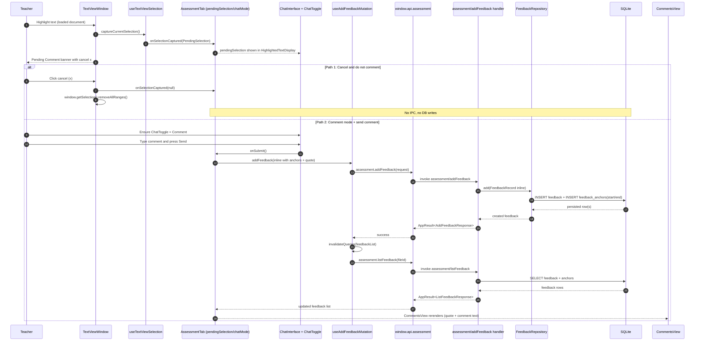

# Vertical Slice: Highlight Text -> Cancel or Comment (End to End)

This slice covers a loaded document in `TextViewWindow` where a teacher highlights text and then either cancels or submits a comment in `ChatInterface` with `Comment` mode selected.

## 1) User input/action

- Teacher highlights text in the loaded document (mouse up / key up in `TextViewWindow`).
- Then one of two paths:
  1. Cancel highlight and do not comment.
  2. Keep `Comment` selected in `ChatToggle`, enter comment text in `ChatInput`, press send.

## 2) React components where actions/inputs occur and related functions/types

- Highlight capture surface:
  - `renderer/src/features/assessment-tab/components/OriginalTextView/TextViewWindow.tsx`
  - Events: `onMouseUp`, `onKeyUp` -> `captureCurrentSelection()`
  - Shows pending banner with cancel button (`cancelPendingComment()`)

- Selection orchestration:
  - `renderer/src/features/assessment-tab/components/OriginalTextView/OriginalTextView.tsx`
  - Passes `onSelectionCaptured` from `AssessmentTab` down to `TextViewWindow`.

- Selection parsing:
  - `renderer/src/features/assessment-tab/components/OriginalTextView/hooks/useTextViewSelection.ts`
  - `captureSelection()` uses `selectionToAnchors(...)` + `PendingSelection` payload.

- Comment input and mode:
  - `renderer/src/features/layout/components/ChatInterface/ChatInterface.tsx`
  - `renderer/src/features/layout/components/ChatInterface/ChatToggle.tsx` (`comment`/`chat`)
  - `renderer/src/features/layout/components/ChatInterface/ChatInput.tsx`
  - `renderer/src/features/layout/components/ChatInterface/HighlightedTextDisplay.tsx` (quote preview)

- Submit/comment orchestration:
  - `renderer/src/features/assessment-tab/components/AssessmentTab.tsx`
  - `handleSubmit()` branches on `chatMode === 'comment'`

- Comments rendering:
  - `renderer/src/features/assessment-tab/components/CommentsView/CommentsView.tsx`
  - `renderer/src/features/assessment-tab/components/CommentsView/CommentView.tsx`
  - `renderer/src/features/assessment-tab/components/CommentsView/CommentBody.tsx` (inline quote shown as `Quote:`)

- Related types:
  - `PendingSelection`, `ChatMode`: `renderer/src/features/assessment-tab/types.ts`
  - `AddInlineFeedbackRequest`, `AddBlockFeedbackRequest`, `FeedbackDto`: `electron/shared/assessmentContracts.ts`

## 3) Related hooks, reducers and services (include filenames)

- Hooks:
  - `useTextViewSelection` (`.../OriginalTextView/hooks/useTextViewSelection.ts`)
  - `useAddFeedbackMutation` (`renderer/src/features/assessment-tab/hooks/useAddFeedbackMutation.ts`)
  - `useFeedbackListQuery` (`renderer/src/features/assessment-tab/hooks/useFeedbackListQuery.ts`)

- Reducer interactions:
  - Pending highlight is local `AssessmentTab` component state (`pendingSelection`), not a reducer slice.
  - On successful add comment, feedback reducer is updated via:
    - `feedback/add`
    - then query invalidation + refetch updates `feedback/setForFile`

- Renderer service/API wrappers:
  - `renderer/src/features/assessment-tab/hooks/feedbackApi.ts`
  - Uses preload `window.api.assessment.addFeedback(...)` and `listFeedback(...)`.

- Main-side services/repos in comment path:
  - IPC handler: `electron/main/ipc/assessmentHandlers.ts` (`assessment/addFeedback`)
  - Repository: `electron/main/db/repositories/feedbackRepository.ts`
  - Helper: `electron/main/db/repositories/sqlHelpers.ts` (`ensureFileRecord`)

## 4) TanStack queries and mutations called (include filenames)

- Mutation used for sending the comment:
  - `useAddFeedbackMutation` in `renderer/src/features/assessment-tab/hooks/useAddFeedbackMutation.ts`
  - Calls `addFeedback(...)` from `feedbackApi.ts`.

- Query used for CommentsView data sync:
  - `useFeedbackListQuery(selectedFileId)` in `renderer/src/features/assessment-tab/hooks/useFeedbackListQuery.ts`
  - Query key: `assessmentQueryKeys.feedbackList(fileId)` (`queryKeys.ts`)
  - On mutation success, `invalidateQueries(...)` triggers refetch.

- Cancel branch:
  - No mutation/query call is made when user cancels pending highlight.

## 5) IPC handlers called and related types

- Submit comment branch:
  - Channel: `assessment/addFeedback`
  - Handler file: `electron/main/ipc/assessmentHandlers.ts`
  - Payload normalization: `normalizeAddFeedbackRequest(...)`
  - Response: `AppResult<AddFeedbackResponse>` with `feedback` DTO

- Comments refresh branch:
  - Channel: `assessment/listFeedback`
  - Handler file: `electron/main/ipc/assessmentHandlers.ts`
  - Response: `AppResult<ListFeedbackResponse>`

- Cancel branch:
  - No IPC call.

## 6) Electron services called and related types

- Submit comment branch (`kind: inline` when highlight exists):
  - `FeedbackRepository.add(...)` in `electron/main/db/repositories/feedbackRepository.ts`
  - `FeedbackRecord` with inline fields:
    - `exactQuote`, `prefixText`, `suffixText`, `startAnchor`, `endAnchor`

- Handler mapping:
  - `toFeedbackDto(...)` in `assessmentHandlers.ts` returns `InlineFeedbackDto` for renderer.

- Cancel branch:
  - No Electron service call.

## 7) Python functions called

- None for both branches.
- Highlighting, canceling, and adding teacher comments do not call the Python worker.

## 8) Any database queries made

### Path A: Cancel highlight and do not comment

- No DB queries.
- `cancelPendingComment()` only clears local pending selection and browser selection range.

### Path B: Submit comment in `Comment` mode

From `FeedbackRepository.add(...)` (`electron/main/db/repositories/feedbackRepository.ts`):

- Ensures file record exists (helper path can read/write `filename`, `filepath`, `entities` if needed):
  - `ensureFileRecord(...)` in `sqlHelpers.ts`

- Inserts feedback row:
  - `INSERT INTO feedback
     (uuid, entity_uuid, kind, source, comment_text, exact_quote, prefix_text, suffix_text, applied, created_at, updated_at)
     VALUES (?, ?, ?, ?, ?, ?, ?, ?, ?, ?, ?);`

- Inserts inline anchors:
  - `INSERT INTO feedback_anchors
     (feedback_uuid, anchor_kind, part, paragraph_index, run_index, text_node_index, char_offset)
     VALUES (?, ?, ?, ?, ?, 0, ?);`
  - called for `start` and `end`.

- Reloads created item:
  - `SELECT ... FROM feedback WHERE uuid = ?;`
  - `SELECT ... FROM feedback_anchors WHERE feedback_uuid = ?;`

From refetch in `listFeedback` (`FeedbackRepository.listByFileId(...)`):

- `SELECT ... FROM feedback WHERE entity_uuid = ? ORDER BY created_at ASC, uuid ASC;`
- `SELECT ... FROM feedback_anchors WHERE feedback_uuid IN (...) ORDER BY feedback_uuid ASC, anchor_kind ASC;`

## Mermaid Workflow Diagram

