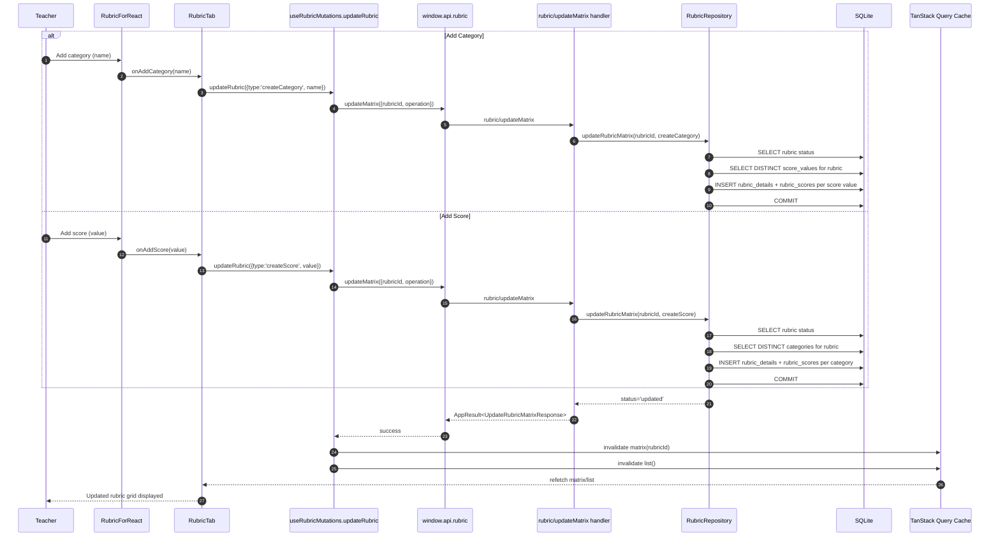

# Vertical Slice: Add New Category and Add New Score to Rubric

This slice covers two rubric-edit actions in the Rubric tab:
- Add new category (`createCategory`)
- Add new score level (`createScore`)

## 1) User input/action

- Teacher is in Rubric tab with an editable rubric selected.
- Teacher performs either:
  - Add category (enters a category name).
  - Add score (enters a numeric score value).

Expected outcome:
- Rubric matrix structure expands.
- Changes persist to database.
- UI refreshes from updated matrix query.

## 2) React components where actions/inputs occur and related functions/types

- `renderer/src/features/rubric-tab/components/RubricTab.tsx`
  - Passes action handlers to rubric UI:
    - `onAddCategory={(name) => updateRubric({ type: 'createCategory', name })}`
    - `onAddScore={(value) => updateRubric({ type: 'createScore', value })}`

- `renderer/src/features/rubric-tab/components/RubricForReact.tsx`
  - Emits add-category and add-score intents.

- Related shared types:
  - `UpdateRubricOperation` with:
    - `{ type: 'createCategory'; name: string }`
    - `{ type: 'createScore'; value: number }`
  - `UpdateRubricMatrixRequest`, `UpdateRubricMatrixResponse`
  - File: `electron/shared/rubricContracts.ts`

## 3) Related hooks, reducers and services (include filenames)

- Hook:
  - `renderer/src/features/rubric-tab/hooks/useRubricMutations.ts`
  - `updateRubric(operation)` mutation handles both operations.

- Reducer behavior:
  - No direct matrix write in reducer for these operations.
  - UI updates from query invalidation/refetch of rubric matrix.

- Renderer service:
  - `renderer/src/features/rubric-tab/services/rubricApi.ts`
  - `updateRubricMatrix(request)`

- Main/repository service:
  - IPC handler: `electron/main/ipc/rubricHandlers.ts` (`rubric/updateMatrix`)
  - Repository: `electron/main/db/repositories/rubricRepository.ts` (`updateRubricMatrix`)

## 4) TanStack queries and mutations called (include filenames)

- Mutation:
  - File: `renderer/src/features/rubric-tab/hooks/useRubricMutations.ts`
  - `mutationFn`: `updateRubricMatrix({ rubricId, operation })`

- Invalidations on mutation success:
  - `rubricQueryKeys.matrix(rubricId)`
  - `rubricQueryKeys.list()`

- Queries that rehydrate data:
  - `useRubricDraftQuery(rubricId)`
  - `useRubricListQuery()`

## 5) IPC handlers called and related types

- Channel:
  - `rubric/updateMatrix`

- Handler file:
  - `electron/main/ipc/rubricHandlers.ts`

- Validation path:
  - `normalizeUpdateRubricMatrixRequest(...)`
  - `normalizeUpdateOperation(...)` supports `createCategory` and `createScore`

- Types:
  - Request: `UpdateRubricMatrixRequest`
  - Response: `UpdateRubricMatrixResponse`
  - Envelope: `AppResult<UpdateRubricMatrixResponse>`

## 6) Electron services called and related types

- `RubricRepository.updateRubricMatrix(rubricId, operation)`

For `createCategory`:
- Reads distinct score values currently in rubric.
- For each score value, inserts a new `rubric_details` row with new category name and empty description.
- Inserts a corresponding `rubric_scores` row for each inserted detail.

For `createScore`:
- Reads distinct categories currently in rubric.
- For each category, inserts a new `rubric_details` row (empty description).
- Inserts a `rubric_scores` row with the new score value for each new detail.

Shared rules:
- Validates rubric exists and is editable (not archived, not active/locked).
- Uses transaction (`BEGIN/COMMIT/ROLLBACK`).
- Handler maps repository statuses (`not_found`, `archived`, `inactive`) to app errors.

## 7) Python functions called

- None.
- These rubric edit operations do not use Python or LLM services.

## 8) Any database queries made

From `RubricRepository.updateRubricMatrix(...)`:

Common pre-check:
- `SELECT entity_uuid, is_active, is_archived FROM rubrics WHERE entity_uuid = ? LIMIT 1;`

For `createCategory`:
- Read existing score levels in rubric:
  - `SELECT DISTINCT rs.score_values
     FROM rubric_scores rs
     INNER JOIN rubric_details rd ON rd.uuid = rs.details_uuid
     WHERE rd.entity_uuid = ?
     ORDER BY rs.score_values DESC;`
- For each score value:
  - `INSERT INTO rubric_details (uuid, entity_uuid, category, description) VALUES (?, ?, ?, ?);`
  - `INSERT INTO rubric_scores (uuid, details_uuid, score_values) VALUES (?, ?, ?);`

For `createScore`:
- Read existing categories in rubric:
  - `SELECT DISTINCT category
     FROM rubric_details
     WHERE entity_uuid = ?
     ORDER BY category COLLATE NOCASE ASC;`
- For each category:
  - `INSERT INTO rubric_details (uuid, entity_uuid, category, description) VALUES (?, ?, ?, ?);`
  - `INSERT INTO rubric_scores (uuid, details_uuid, score_values) VALUES (?, ?, ?);`

Transaction boundary:
- `BEGIN;` / `COMMIT;` / `ROLLBACK;`

## Mermaid Workflow Diagram

