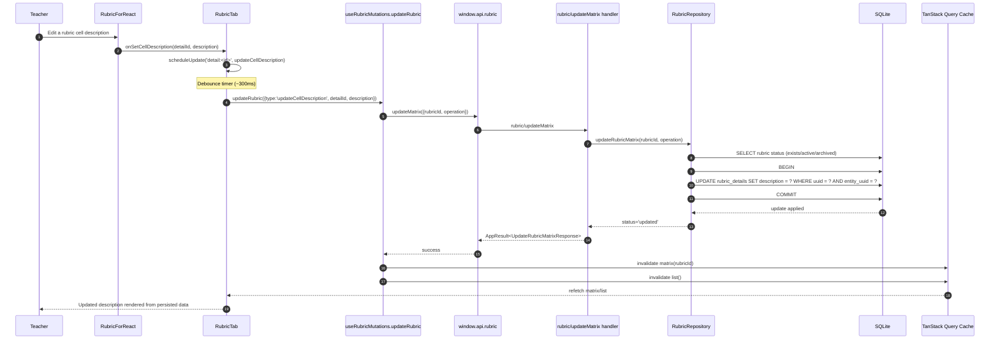

# Vertical Slice: Edit Rubric Description

This slice covers editing a rubric cell description in the Rubric tab and persisting the change.

## 1) User input/action

- Teacher is in `Rubric` tab, editing mode.
- Teacher changes the text in a rubric cell description.
- Expected outcome:
  - Change is debounced in UI.
  - Updated description is saved to database.
  - Rubric matrix is reloaded so UI reflects persisted state.

## 2) React components where actions/inputs occur and related functions/types

- `renderer/src/features/rubric-tab/components/RubricTab.tsx`
  - Passes description edit handler into rubric UI:
    - `onSetCellDescription={(detailId, description) => scheduleUpdate(...{ type: 'updateCellDescription', detailId, description })}`

- `renderer/src/features/rubric-tab/components/RubricForReact.tsx`
  - Emits description change callbacks for rubric cells.

- Related contract types:
  - `UpdateRubricOperation` (`type: 'updateCellDescription'`)
  - `UpdateRubricMatrixRequest` / `UpdateRubricMatrixResponse`
  - File: `electron/shared/rubricContracts.ts`

## 3) Related hooks, reducers and services (include filenames)

- Hook handling update mutation:
  - `renderer/src/features/rubric-tab/hooks/useRubricMutations.ts`
  - `updateRubric(operation)` -> `updateRubricMatrix({ rubricId, operation })`

- Debounce/orchestration logic:
  - `renderer/src/features/rubric-tab/components/RubricTab.tsx`
  - `scheduleUpdate(operationKey, operation)` uses `setTimeout(300)` per detail key.
  - `flushPendingUpdates()` runs pending operations on unmount and certain tab/rubric transitions.

- Reducer involvement:
  - No direct rubric reducer write for cell text in this path.
  - UI rehydrates from query result after mutation invalidation.

- Renderer service/API wrapper:
  - `renderer/src/features/rubric-tab/services/rubricApi.ts`
  - `updateRubricMatrix(request)` calls preload rubric API.

- Main/repository service:
  - `electron/main/ipc/rubricHandlers.ts` (`rubric/updateMatrix`)
  - `electron/main/db/repositories/rubricRepository.ts` (`updateRubricMatrix`)

## 4) TanStack queries and mutations called (include filenames)

- Mutation:
  - `useRubricMutations` in `renderer/src/features/rubric-tab/hooks/useRubricMutations.ts`
  - `mutationFn`: `updateRubricMatrix({ rubricId, operation })`

- Query invalidations on success:
  - `rubricQueryKeys.matrix(rubricId)`
  - `rubricQueryKeys.list()`

- Query used to repopulate data:
  - `useRubricDraftQuery(rubricId)` -> `rubricQueryKeys.matrix(rubricId)`

## 5) IPC handlers called and related types

- Channel:
  - `rubric/updateMatrix`

- Handler file:
  - `electron/main/ipc/rubricHandlers.ts`

- Payload normalization path:
  - `normalizeUpdateRubricMatrixRequest(...)`
  - `normalizeUpdateOperation(...)` for `type: 'updateCellDescription'`

- Types:
  - Request: `UpdateRubricMatrixRequest`
  - Response: `UpdateRubricMatrixResponse`
  - Envelope: `AppResult<UpdateRubricMatrixResponse>`

## 6) Electron services called and related types

- `RubricRepository.updateRubricMatrix(rubricId, operation)`
  - Validates rubric exists and is editable:
    - not archived
    - not active/locked
  - For description edit operation:
    - `UPDATE rubric_details SET description = ? WHERE uuid = ? AND entity_uuid = ?;`
  - Wrapped in transaction (`BEGIN/COMMIT/ROLLBACK`).

- Returned status from repository:
  - `updated | not_found | inactive | archived`
  - Handler maps non-updated statuses to typed app errors.

## 7) Python functions called

- None.
- Editing rubric description does not involve Python/LLM.

## 8) Any database queries made

From `RubricRepository.updateRubricMatrix(...)`:

- Validate rubric row and lock status:
  - `SELECT entity_uuid, is_active, is_archived FROM rubrics WHERE entity_uuid = ? LIMIT 1;`

- Description update operation:
  - `UPDATE rubric_details
     SET description = ?
     WHERE uuid = ?
       AND entity_uuid = ?;`

- Transaction control:
  - `BEGIN;` / `COMMIT;` / `ROLLBACK;`

Notes:
- No direct insert/delete occurs for description edit.
- UI refresh is query-driven after mutation invalidation.

## Mermaid Workflow Diagram

