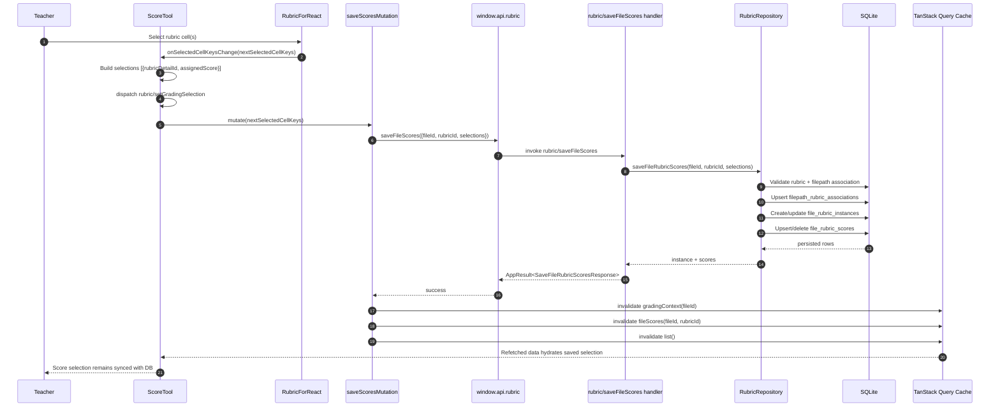

# Vertical Slice: Score With Rubric in CommentsView Score Tab

This slice covers grading an essay by selecting rubric cells in `CommentsView -> Score` and persisting scores.

## 1) User input/action

- Teacher opens `CommentsView` and is on the `Score` tab.
- Teacher selects one or more rubric cells in the grading rubric UI (`RubricForReact`).
- App saves selected rubric scores for the current file.

## 2) React components where actions/inputs occur and related functions/types

- `renderer/src/features/assessment-tab/components/CommentsView/CommentsView.tsx`
  - Renders `ScoreTool` when `activeTab === 'score'`.

- `renderer/src/features/assessment-tab/components/CommentsView/ScoreTool.tsx`
  - Renders grading rubric (`RubricForReact` with `isGrading`).
  - Handles `onSelectedCellKeysChange(nextSelectedCellKeys)`.
  - Triggers save mutation when selected cells change.

- `renderer/src/features/rubric-tab/components/RubricForReact.tsx`
  - Emits selected cell key changes to `ScoreTool`.

- Related types:
  - `SaveFileRubricScoresRequest/Response`: `electron/shared/rubricContracts.ts`
  - `FileRubricInstanceDto`, `FileRubricScoreDto`: `electron/shared/rubricContracts.ts`
  - `RubricGradingSelection` state model: `renderer/src/types/state.ts`

## 3) Related hooks, reducers and services (include filenames)

- In `ScoreTool.tsx`:
  - Queries used to compute context and hydrate selections:
    - rubric list (`useRubricListQuery`)
    - grading context (`useQuery` with `rubricQueryKeys.gradingContext`)
    - rubric matrix (`useRubricDraftQuery`)
    - file scores (`useQuery` with `rubricQueryKeys.fileScores`)
  - Save mutation:
    - `saveScoresMutation = useMutation(...)` -> calls `saveFileRubricScores(...)`

- Reducer actions dispatched during scoring:
  - `rubric/setGradingSelection`
  - `rubric/selectGradingForFile`
  - `rubric/setLockedGradingRubricId`

- Services:
  - Renderer API: `renderer/src/features/rubric-tab/services/rubricApi.ts`
    - `saveFileRubricScores(fileId, rubricId, selections)`
  - Main repository service:
    - `electron/main/db/repositories/rubricRepository.ts` (`saveFileRubricScores`)

## 4) TanStack queries and mutations called (include filenames)

- Mutation (core save path):
  - File: `renderer/src/features/assessment-tab/components/CommentsView/ScoreTool.tsx`
  - `saveScoresMutation`:
    - builds `selections` from selected cell keys
    - calls `saveFileRubricScores(fileId, effectiveRubricId, selections)`

- Invalidations after save success:
  - `rubricQueryKeys.gradingContext(fileId)`
  - `rubricQueryKeys.fileScores(fileId, effectiveRubricId)`
  - `rubricQueryKeys.list()`

- Supporting queries (already active in ScoreTool):
  - `rubricQueryKeys.list()`
  - `rubricQueryKeys.gradingContext(fileId)`
  - `rubricQueryKeys.matrix(effectiveRubricId)`
  - `rubricQueryKeys.fileScores(fileId, effectiveRubricId)`

## 5) IPC handlers called and related types

- Save operation:
  - Channel: `rubric/saveFileScores`
  - Handler: `electron/main/ipc/rubricHandlers.ts`
  - Request type: `SaveFileRubricScoresRequest`
  - Response type: `SaveFileRubricScoresResponse`

- Follow-up rehydration calls after invalidation:
  - `rubric/getGradingContext`
  - `rubric/getFileScores`
  - `rubric/listRubrics`

- Shared contracts:
  - `electron/shared/rubricContracts.ts`
  - `electron/shared/appResult.ts`

## 6) Electron services called and related types

Via `rubric/saveFileScores` handler:

- `RubricRepository.saveFileRubricScores(fileId, rubricId, selections)`
  - Validates rubric exists and not archived.
  - Enforces folder-level rubric association lock in `filepath_rubric_associations`.
  - Sets rubric active (`rubrics.is_active = 1`).
  - Creates or updates `file_rubric_instances`.
  - Upserts/deletes `file_rubric_scores` to match current selected cells.

Related DTO outputs returned to renderer:
- `instance: FileRubricInstanceDto`
- `scores: FileRubricScoreDto[]`

## 7) Python functions called

- None.
- Rubric scoring is local renderer + Electron + SQLite only.

## 8) Any database queries made

From `RubricRepository.saveFileRubricScores(...)` (`electron/main/db/repositories/rubricRepository.ts`):

- Ensure file/rubric identity records (helper path):
  - `ensureFileRecord(...)` (may touch `filename`, `filepath`, `entities`)
  - `ensureEntity(..., 'rubric', ...)`

- Validate rubric:
  - `SELECT entity_uuid, is_archived FROM rubrics WHERE entity_uuid = ? LIMIT 1;`

- Resolve file's folder:
  - `SELECT filepath_uuid FROM filename WHERE entity_uuid = ? LIMIT 1;`

- Check existing folder rubric association:
  - `SELECT filepath_uuid, rubric_entity_uuid, created_at, edited_at
     FROM filepath_rubric_associations
     WHERE filepath_uuid = ? LIMIT 1;`

- Upsert folder rubric association:
  - `INSERT INTO filepath_rubric_associations (...) VALUES (...) ON CONFLICT(filepath_uuid) DO UPDATE ...;`

- Mark rubric active:
  - `UPDATE rubrics SET is_active = 1 WHERE entity_uuid = ?;`

- Load/create/update grading instance:
  - `SELECT ... FROM file_rubric_instances WHERE file_entity_uuid = ? AND rubric_entity_uuid = ? ... LIMIT 1;`
  - `INSERT INTO file_rubric_instances ...` or `UPDATE file_rubric_instances SET edited_at = ? ...`

- For each selected rubric detail:
  - Validate detail belongs to rubric:
    - `SELECT uuid FROM rubric_details WHERE uuid = ? AND entity_uuid = ? LIMIT 1;`
  - Upsert score row:
    - `SELECT uuid FROM file_rubric_scores WHERE rubric_instance_uuid = ? AND rubric_detail_uuid = ? LIMIT 1;`
    - `UPDATE file_rubric_scores SET assigned_score = ?, edited_at = ? WHERE uuid = ?;`
      or
    - `INSERT INTO file_rubric_scores (...) VALUES (...);`

- Delete deselected rows to keep DB aligned with UI selection:
  - `DELETE FROM file_rubric_scores WHERE rubric_instance_uuid = ? AND rubric_detail_uuid NOT IN (...);`

- Returns saved view using `getFileRubricScores(...)`:
  - `SELECT ... FROM file_rubric_instances ... LIMIT 1;`
  - `SELECT ... FROM file_rubric_scores WHERE rubric_instance_uuid = ? ...;`

All writes are wrapped in a transaction (`BEGIN/COMMIT/ROLLBACK`).

## Mermaid Workflow Diagram

