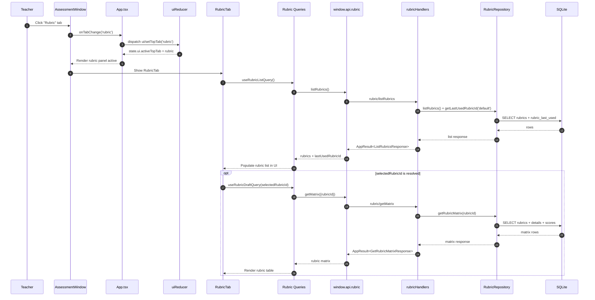

# Vertical Slice: Select Rubric Tab in AssessmentWindow

This slice covers what happens when the teacher clicks the `Rubric` tab in `AssessmentWindow`.

## 1) User input/action

- Teacher clicks the `Rubric` tab button in `AssessmentWindow`.
- Expected outcome:
  - Top-level UI tab state changes from current tab to `rubric`.
  - `RubricTab` panel becomes visible and active.
  - Rubric list loading flow starts (or reads from query cache).

## 2) React components where actions/inputs occur and related functions/types

- `renderer/src/features/assessment-window/components/AssessmentWindow.tsx`
  - Rubric tab button:
    - `onClick={() => onTabChange('rubric')}`
  - Panel visibility:
    - rubric panel `hidden={activeTab !== 'rubric'}`

- `renderer/src/App.tsx`
  - Passes `activeTab={activeTopTab}` to `AssessmentWindow`
  - Handles tab change with:
    - `onTabChange={(tab) => dispatch({ type: 'ui/setTopTab', payload: tab })}`

- `renderer/src/features/rubric-tab/components/RubricTab.tsx`
  - Rendered inside rubric panel and becomes user-visible when top tab is `rubric`.

- Related types:
  - `AssessmentTopTab`: `renderer/src/state/types.ts`
  - Rubric contracts: `electron/shared/rubricContracts.ts`

## 3) Related hooks, reducers and services (include filenames)

- Reducer/action for tab selection:
  - `uiReducer` in `renderer/src/state/reducers.ts`
  - Action: `ui/setTopTab`

- RubricTab hooks that run when tab is active/rendered:
  - `useRubricListQuery` (`renderer/src/features/rubric-tab/hooks/useRubricListQuery.ts`)
  - `useRubricDraftQuery(selectedRubricId)` (`renderer/src/features/rubric-tab/hooks/useRubricDraftQuery.ts`)
  - `useRubricMutations(selectedRubricId)` (`renderer/src/features/rubric-tab/hooks/useRubricMutations.ts`)

- Services used:
  - `renderer/src/features/rubric-tab/services/rubricApi.ts`
    - `listRubrics()`
    - `getRubricMatrix(rubricId)` (only when a rubric is selected)

## 4) TanStack queries and mutations called (include filenames)

When Rubric tab is selected and `RubricTab` is active:

- Query:
  - `useRubricListQuery` -> `rubricQueryKeys.list()`
  - File: `renderer/src/features/rubric-tab/hooks/useRubricListQuery.ts`

- Conditional query:
  - `useRubricDraftQuery(selectedRubricId)` -> `rubricQueryKeys.matrix(rubricId)`
  - File: `renderer/src/features/rubric-tab/hooks/useRubricDraftQuery.ts`
  - Enabled only when `selectedRubricId` exists.

- Mutations:
  - None are required just to select the tab.
  - (`create/clone/delete/update` mutations are available but user-triggered later.)

## 5) IPC handlers called and related types

As part of rubric tab load path:

- `rubric/listRubrics`
  - Handler: `electron/main/ipc/rubricHandlers.ts`
  - Response type: `ListRubricsResponse`

- Potential follow-up if a rubric is selected:
  - `rubric/getMatrix`
  - Handler: `electron/main/ipc/rubricHandlers.ts`
  - Request: `GetRubricMatrixRequest`
  - Response: `GetRubricMatrixResponse`

Contracts:
- `electron/shared/rubricContracts.ts`
- `electron/shared/appResult.ts`

## 6) Electron services called and related types

Via rubric handlers:

- `RubricRepository.listRubrics()`
- `RubricRepository.getLastUsedRubricId('default')`
- `RubricRepository.getRubricMatrix(rubricId)` (if matrix requested)

Repository file:
- `electron/main/db/repositories/rubricRepository.ts`

## 7) Python functions called

- None.
- Selecting `Rubric` top tab does not involve Python or LLM flows.

## 8) Any database queries made

From `RubricRepository.listRubrics()` and `getLastUsedRubricId()`:

- `SELECT entity_uuid, name, type, is_active, is_archived
   FROM rubrics
   WHERE is_archived = 0
   ORDER BY name COLLATE NOCASE ASC, entity_uuid ASC;`

- `SELECT rlu.profile_key, rlu.rubric_entity_uuid, rlu.updated_at
   FROM rubric_last_used rlu
   INNER JOIN rubrics r ON r.entity_uuid = rlu.rubric_entity_uuid
   WHERE rlu.profile_key = ?
     AND r.is_archived = 0
   LIMIT 1;`

If matrix loads for selected rubric (`getRubricMatrix`):

- `SELECT ... FROM rubrics WHERE entity_uuid = ? AND is_archived = 0 LIMIT 1;`
- `SELECT ... FROM rubric_details WHERE entity_uuid = ? ORDER BY ...;`
- `SELECT ... FROM rubric_scores WHERE details_uuid IN (...) ORDER BY score_values DESC, uuid ASC;`

## Mermaid Workflow Diagram

