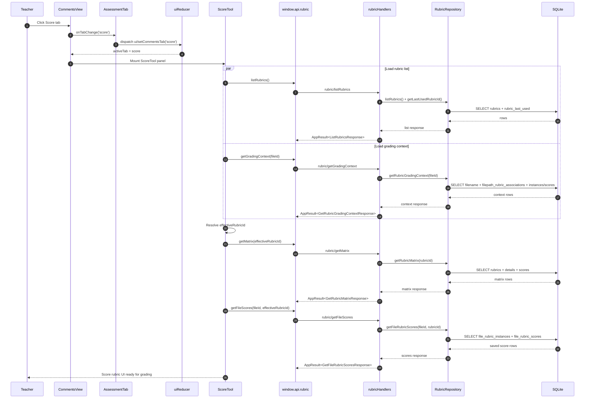

# Vertical Slice: Select Score Tab in CommentsView

This slice covers what happens when the teacher switches from `Comments` to `Score` in `CommentsView`.

## 1) User input/action

- Teacher clicks the `Score` tab button in `CommentsView`.
- Expected outcome:
  - UI tab state changes to `score`.
  - `ScoreTool` panel becomes active.
  - Rubric-related queries run (or rehydrate from cache) to show grading UI.

## 2) React components where actions/inputs occur and related functions/types

- `renderer/src/features/assessment-tab/components/CommentsView/CommentsView.tsx`
  - Score button click: `onClick={() => onTabChange('score')}`
  - Score panel render gate: `{activeTab === 'score' ? <ScoreTool /> : null}`

- `renderer/src/features/assessment-tab/components/AssessmentTab.tsx`
  - Passes `activeTab={activeCommentsTab}` into `CommentsView`
  - Passes `onTabChange={(tab) => dispatch({ type: 'ui/setCommentsTab', payload: tab })}`

- `renderer/src/features/assessment-tab/components/CommentsView/ScoreTool.tsx`
  - Activated when score tab is selected; runs rubric context + score loading logic.

- Related types:
  - `CommentsTab`: `renderer/src/state/types.ts`
  - Rubric request/response DTOs: `electron/shared/rubricContracts.ts`

## 3) Related hooks, reducers and services (include filenames)

- Reducer/action:
  - `uiReducer` in `renderer/src/state/reducers.ts`
  - Action: `ui/setCommentsTab`

- Hooks used after `ScoreTool` mounts:
  - `useRubricListQuery` (`renderer/src/features/rubric-tab/hooks/useRubricListQuery.ts`)
  - `useRubricDraftQuery` (`renderer/src/features/rubric-tab/hooks/useRubricDraftQuery.ts`)
  - Local `useQuery` calls in `ScoreTool.tsx` for:
    - grading context
    - file rubric scores

- Rubric services used by those hooks/queries:
  - `renderer/src/features/rubric-tab/services/rubricApi.ts`
    - `listRubrics`
    - `getRubricGradingContext`
    - `getFileRubricScores`
    - `getRubricMatrix`

- State updates in `ScoreTool` effects:
  - rubric selection + lock state:
    - `rubric/selectGradingForFile`
    - `rubric/setLockedGradingRubricId`
    - `rubric/setGradingSelection`

## 4) TanStack queries and mutations called (include filenames)

When `Score` tab is selected and `ScoreTool` is mounted:

- Query: rubric list
  - File: `renderer/src/features/rubric-tab/hooks/useRubricListQuery.ts`
  - Key: `rubricQueryKeys.list()`

- Query: grading context (selected file -> locked/selected rubric)
  - File: `renderer/src/features/assessment-tab/components/CommentsView/ScoreTool.tsx`
  - Key: `rubricQueryKeys.gradingContext(fileId ?? 'none')`

- Query: rubric matrix for effective rubric
  - File: `renderer/src/features/rubric-tab/hooks/useRubricDraftQuery.ts`
  - Key: `rubricQueryKeys.matrix(rubricId ?? 'none')`

- Query: saved file scores for file+rubric
  - File: `renderer/src/features/assessment-tab/components/CommentsView/ScoreTool.tsx`
  - Key: `rubricQueryKeys.fileScores(fileId ?? 'none', rubricId ?? 'none')`

- Mutations on tab selection itself:
  - None required for just opening Score tab.
  - (`saveScores` / `clearApplied` mutations in `ScoreTool.tsx` run only when teacher edits or changes rubric.)

## 5) IPC handlers called and related types

Potential handlers called by the queries above:

- `rubric/listRubrics`
  - Handler: `electron/main/ipc/rubricHandlers.ts`
  - Response: `ListRubricsResponse`

- `rubric/getGradingContext`
  - Handler: `electron/main/ipc/rubricHandlers.ts`
  - Request: `GetRubricGradingContextRequest`
  - Response: `GetRubricGradingContextResponse`

- `rubric/getMatrix`
  - Handler: `electron/main/ipc/rubricHandlers.ts`
  - Request: `GetRubricMatrixRequest`
  - Response: `GetRubricMatrixResponse`

- `rubric/getFileScores`
  - Handler: `electron/main/ipc/rubricHandlers.ts`
  - Request: `GetFileRubricScoresRequest`
  - Response: `GetFileRubricScoresResponse`

- Contracts:
  - `electron/shared/rubricContracts.ts`
  - `electron/shared/appResult.ts`

## 6) Electron services called and related types

Via rubric handlers, main delegates to:

- `RubricRepository.listRubrics()`
- `RubricRepository.getRubricGradingContext(fileId)`
- `RubricRepository.getRubricMatrix(rubricId)`
- `RubricRepository.getFileRubricScores(fileId, rubricId)`

File:
- `electron/main/db/repositories/rubricRepository.ts`

Key DTOs returned through handlers:
- `RubricDto`, `RubricDetailDto`, `RubricScoreDto`
- `FileRubricInstanceDto`, `FileRubricScoreDto`

## 7) Python functions called

- None.
- Selecting Score tab and loading rubric context/scores does not call Python.

## 8) Any database queries made

From `RubricRepository` methods used in this slice:

- `listRubrics()`
  - `SELECT entity_uuid, name, type, is_active, is_archived
     FROM rubrics
     WHERE is_archived = 0
     ORDER BY name COLLATE NOCASE ASC, entity_uuid ASC;`

- `getLastUsedRubricId(...)` (called by list handler)
  - `SELECT rlu.profile_key, rlu.rubric_entity_uuid, rlu.updated_at
     FROM rubric_last_used rlu
     INNER JOIN rubrics r ON r.entity_uuid = rlu.rubric_entity_uuid
     WHERE rlu.profile_key = ? AND r.is_archived = 0 LIMIT 1;`

- `getRubricGradingContext(fileId)`
  - Reads file path mapping:
    - `SELECT filepath_uuid FROM filename WHERE entity_uuid = ? LIMIT 1;`
  - Reads folder-locked rubric:
    - `SELECT rubric_entity_uuid FROM filepath_rubric_associations WHERE filepath_uuid = ? LIMIT 1;`
  - Reads rubric already used for this file:
    - `SELECT fri.rubric_entity_uuid ... FROM file_rubric_instances fri
       INNER JOIN file_rubric_scores frs ON frs.rubric_instance_uuid = fri.uuid
       WHERE fri.file_entity_uuid = ? ... LIMIT 1;`

- `getRubricMatrix(rubricId)`
  - `SELECT ... FROM rubrics WHERE entity_uuid = ? AND is_archived = 0 LIMIT 1;`
  - `SELECT ... FROM rubric_details WHERE entity_uuid = ? ORDER BY ...;`
  - `SELECT ... FROM rubric_scores WHERE details_uuid IN (...) ORDER BY score_values DESC, uuid ASC;`

- `getFileRubricScores(fileId, rubricId)`
  - `SELECT ... FROM file_rubric_instances WHERE file_entity_uuid = ? AND rubric_entity_uuid = ? ... LIMIT 1;`
  - `SELECT ... FROM file_rubric_scores WHERE rubric_instance_uuid = ? ORDER BY created_at ASC, uuid ASC;`

## Mermaid Workflow Diagram

