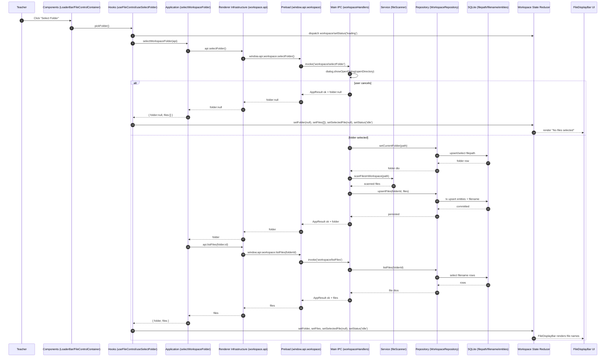

# Vertical Slice: Folder Selection (Refactored Workspace Feature)

This document tracks the current end-to-end flow for folder selection in the refactored workspace feature. It is written for code auditing: each step maps to concrete files and layer boundaries.

## Scope

This slice covers:
1. Teacher selects a workspace folder.
2. App scans files and persists folder/file metadata.
3. Renderer loads files for the selected folder.
4. Workspace UI updates to show files.

This slice does **not** call Python/LLM.

## Layer Map (Renderer Feature)

### Components layer
- `renderer/src/features/workspace/FileControlContainer.tsx`
- `renderer/src/features/workspace/components/FileControl.tsx`
- `renderer/src/features/workspace/components/LoaderBar.tsx`
- `renderer/src/features/workspace/components/FileDisplayBar.tsx`

Responsibilities:
- Capture teacher click (`LoaderBar` button).
- Render file list and selected file state.
- Delegate all logic to hooks.

### Hooks layer
- `renderer/src/features/workspace/hooks/useFileControl.ts`
- `renderer/src/features/workspace/hooks/useSelectFolder.ts`

Responsibilities:
- Bridge UI events to mutation workflow.
- Dispatch workspace and chat actions.
- Handle loading/error state transitions and toast errors.

### Application layer
- `renderer/src/features/workspace/application/workspace.service.ts`

Responsibilities:
- Orchestrate use case: `selectFolder` then `listFiles`.
- Convert API result failures into thrown errors for hook-level handling.
- Handle cancel case (`folder: null`) without error.

### Domain layer
- `renderer/src/features/workspace/domain/workspace.types.ts`
- `renderer/src/features/workspace/domain/fileKind.ts`
- `renderer/src/features/workspace/domain/workspace.mappers.ts`
- `renderer/src/features/workspace/domain/workspace.commands.ts`

Responsibilities:
- Own workspace types (`WorkspaceFolder`, `WorkspaceFile`, `WorkspaceState`, etc.).
- Normalize file kind values (`fileKindFromExtension`).
- Map shared IPC DTOs -> workspace domain models.

### Infrastructure layer (renderer boundary)
- `renderer/src/features/workspace/infrastructure/workspace.api.ts`
- `electron/preload/index.ts`
- `electron/shared/workspaceContracts.ts`
- `electron/shared/appResult.ts`

Responsibilities:
- Typed boundary for `window.api.workspace`.
- IPC invocation for `workspace/selectFolder`, `workspace/listFiles`, `workspace/getCurrentFolder`.
- Shared contracts and success/failure envelope.

### State layer
- Feature-owned state:
  - `renderer/src/features/workspace/state/workspace.actions.ts`
  - `renderer/src/features/workspace/state/workspace.reducer.ts`
- Root composition:
  - `renderer/src/state/reducers.ts`
  - `renderer/src/state/initialState.ts`

Responsibilities:
- Own workspace actions/reducer/initial state in feature.
- Compose workspace reducer into root app reducer.

## Electron Backend Flow (Persistence + IPC)

### IPC handlers
- `electron/main/ipc/workspaceHandlers.ts`

Behavior:
1. `workspace/selectFolder`
- Opens native directory picker.
- On cancel: returns `{ ok: true, data: { folder: null } }`.
- On selection:
  - persists/updates folder in `filepath` table,
  - scans files recursively (depth 2),
  - upserts file rows in `filename` (+ `entities` for new files).

2. `workspace/listFiles`
- Validates `folderId`.
- Reads persisted file rows for folder.
- Returns DTOs for renderer mapping.

### Services
- `electron/main/services/fileScanner.ts`

Behavior:
- Recursively scans up to 2 levels.
- Returns discovered files with path/name/extension.

### Repository + DB
- `electron/main/db/repositories/workspaceRepository.ts`
- `electron/main/db/repositories/sqlHelpers.ts`
- Tables involved: `filepath`, `filename`, `entities`

Key queries/operations:
- `setCurrentFolder(folderPath)`
  - `SELECT filepath by path`
  - `UPDATE filepath.created_at` if exists, else `INSERT filepath`
- `upsertFiles(folderId, files)` in transaction
  - validate folder exists
  - update folder timestamp
  - per file: find existing filename row by `(filepath_uuid, append_path, file_name)`
  - create `entities` row for new file via `ensureEntity`
  - `INSERT ... ON CONFLICT(entity_uuid) DO UPDATE` into `filename`
- `listFiles(folderId)`
  - lookup folder path
  - select filename rows by folder
  - resolve full path and infer kind from filename extension

## Sequence Diagram

## Audit Checklist

1. UI-to-hook boundary
- `LoaderBar` must only receive `onSelectFolder` and `isLoading`.
- No IPC calls in components.

2. Hook-to-application boundary
- `useSelectFolder` should call only `selectWorkspaceFolder(api)` for orchestration.
- State transitions: `loading -> idle|error`.

3. Application-to-infrastructure boundary
- `workspace.service.ts` should not touch `window` directly.
- It should depend on `WorkspaceApi` interface only.

4. Domain purity
- DTO mapping should stay in `workspace.mappers.ts`.
- File kind logic should stay in `domain/fileKind.ts`.

5. State ownership
- Workspace actions/reducer/initial state must remain feature-owned under `features/workspace/state`.
- Root reducer should only compose workspace reducer.

6. IPC + persistence
- `workspace/selectFolder` must persist folder and scan/upsert files.
- `workspace/listFiles` must read persisted rows, not re-scan disk.

7. Cancel behavior
- Folder dialog cancel should return success with `folder: null` and keep UI non-error.

8. No Python dependency
- This slice should not call `LlmOrchestrator` or Python worker.

